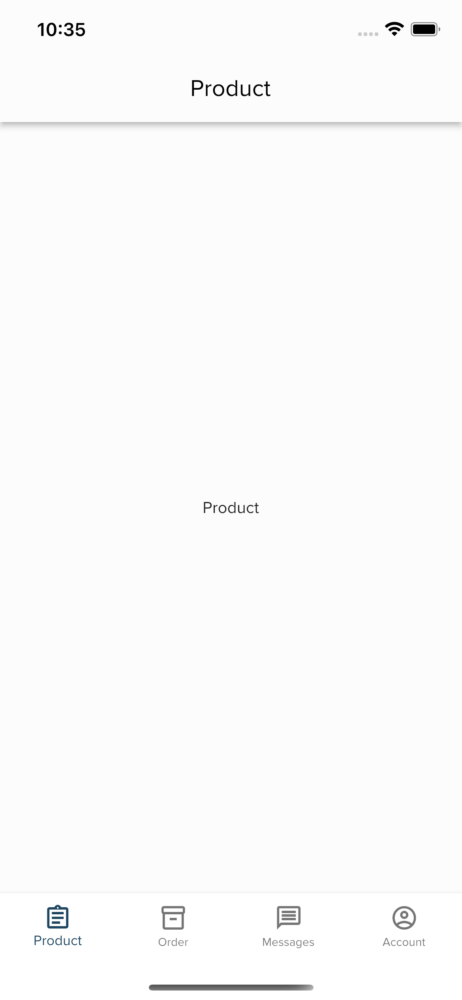
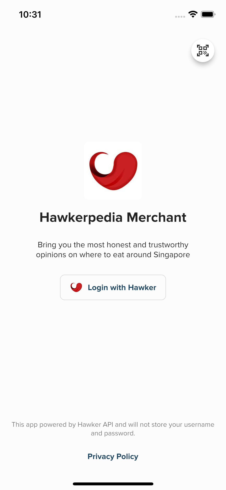
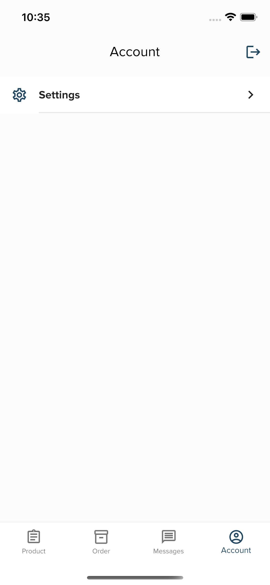
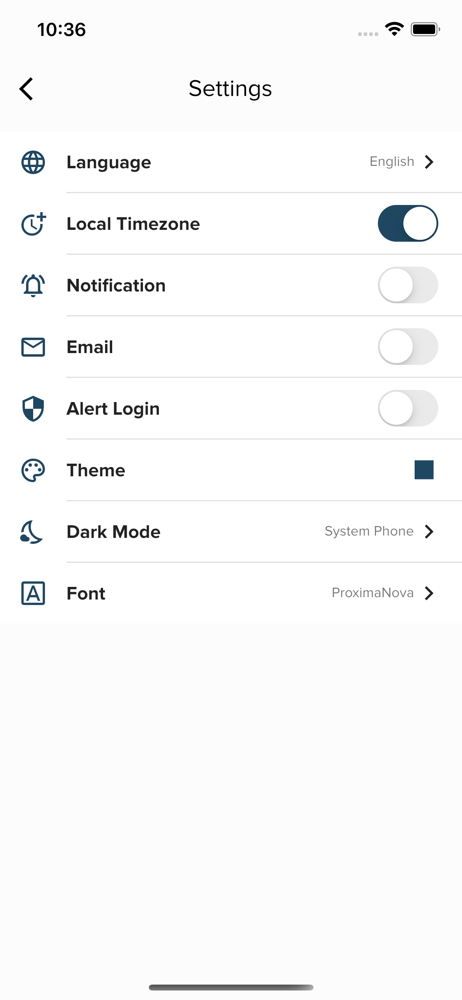
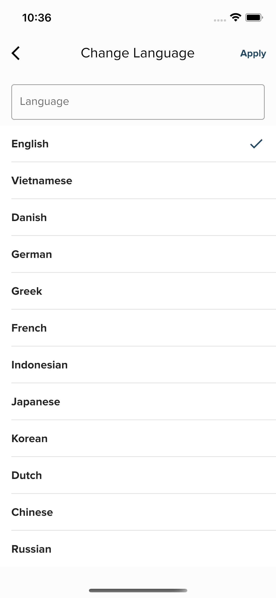

# Boilerplate Project

A boilerplate project created in flutter using Bloc. Boilerplate supports build mobile apps to faster.

## Getting Started

The Boilerplate contains the minimal implementation required to create a new library or project. 

## How to clone and run project

## Boilerplate Features:

### Feture
* State management with Cubit and Bloc
* Authentication
* Notification with firebase messaging, firebase analytics
* Multiple Theme, Dark Theme, Custom Colors
* Multiple language
* Multiple font
* Database
* Routing
* Theme
* Validation
* Mock Restful API with Dio
* Logging
* CI/CD github action

### Current Screen
* SplashScreen
* Login
* Home
* Account
* Account/Setting

Some screenshots: 

<p float="left">
  
   
  
</p>

<p float="left">
  
   
  
</p>

### Folder Structure
Here is the core folder structure which flutter provides.

```
flutter_bloc_boilerplate/
|- android
|- build
|- ios
|- lib
```

Here is the folder structure we have been using in this project

```
lib/
|- api/
|- blocs/
|- configs/
|- database/
|- models/
|- repositorys/
|- screens/
|- utils/
|- widgets/
```

## Conclusion

